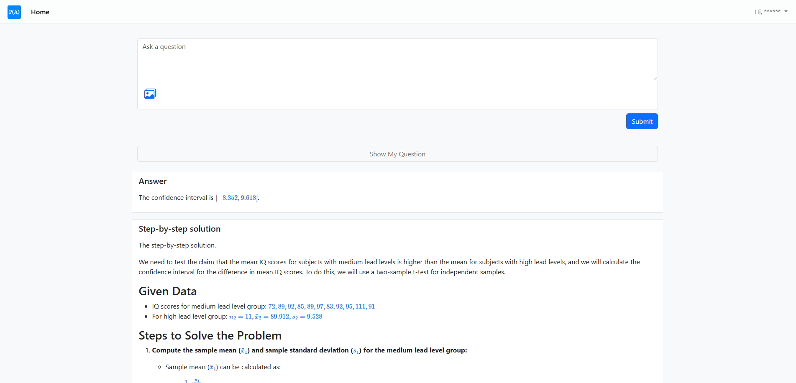
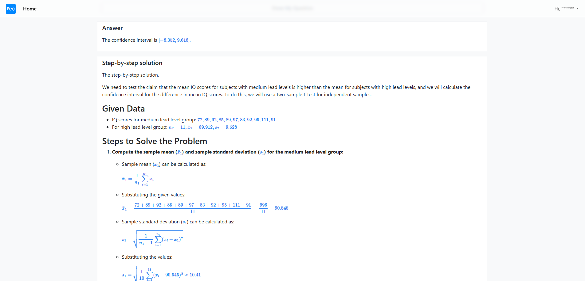
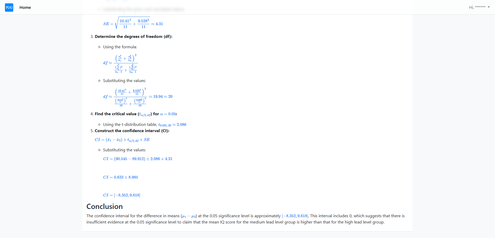
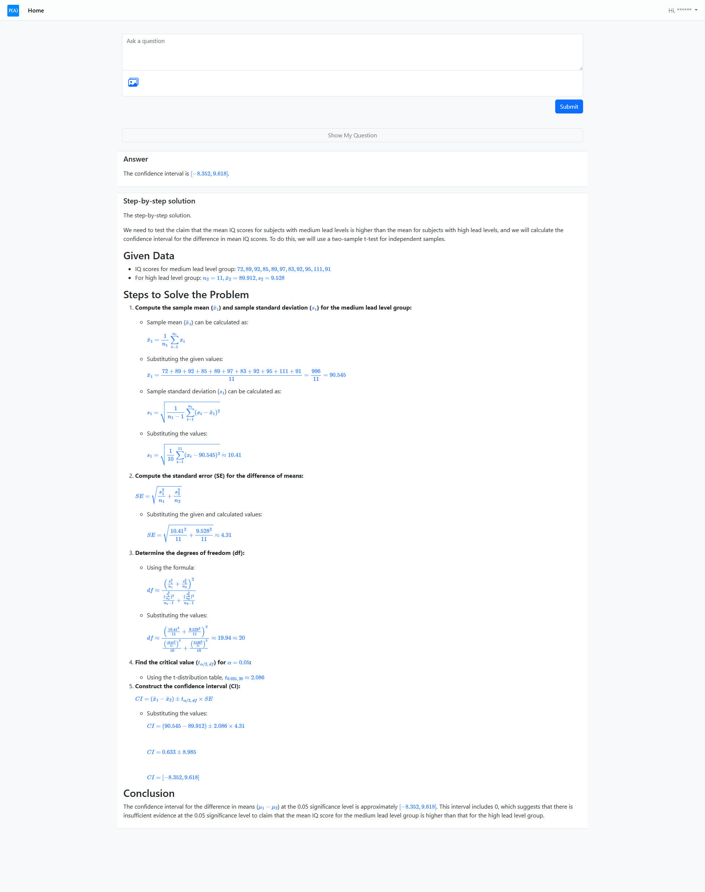

# AI Homework Helper

AI Homework Helper is a Flask web application that takes a homework question, optionally accepts image uploads, sends the request through a multi-stage OpenAI workflow, and renders a polished answer plus a step-by-step solution in the browser.

The current implementation is centered on Statistics and Probability tutoring. It uses:

- a chat completion model to analyze the question and outline the solving process
- an OpenAI Assistant to work through the solution in more depth
- a second chat completion pass to merge both outputs into a final response format

The app also stores the latest request/response artifacts on disk so the last result remains visible after the page reloads.






## Features

- Flask-based local web UI
- Text question input with optional image uploads
- Multi-stage OpenAI workflow:
	- first-pass reasoning via chat completion
	- assistant-based solution generation
	- final merged answer formatting
- LaTeX rendering in the browser through MathJax
- Markdown rendering for final answer sections
- Image placeholders in AI output converted to rendered images in the UI
- Persistent output files for the latest run
- Rotating application logs
- Automatic cleanup of old uploaded/generated images
- Audio notification when processing finishes

## Current Workflow

At runtime, the application follows this sequence:

1. The user submits a question from the web form.
2. Optional image uploads are saved under static/input/images/ and converted to base64 if present.
3. A chat completion call generates the process of solving the problem.
4. That result is sent to an OpenAI Assistant for a fuller solution.
5. A merger chat completion rewrites the combined output into this required format:

```text
[Answer]
...

[Step-by-step solution]
...
```

6. The final response is saved to disk and rendered in the browser.
7. LaTeX, Markdown, and generated image placeholders are converted for display on the frontend.

## Tech Stack

- Python
- Flask
- OpenAI Python SDK
- Bootstrap 5
- jQuery
- bootstrap-fileinput
- markdown-it
- MathJax
- PyYAML

## Project Structure

```text
AI Homework Helper/
|-- main.py                          # Flask entrypoint
|-- processor.py                     # Request processing and output persistence
|-- definitions.py                   # Path constants resolved from definitions.json
|-- definitions.json                 # Root-relative file and folder paths
|-- requirements.txt                 # Python dependencies
|-- brain/
|   |-- brain.py                     # OpenAI client and brain wiring
|   |-- brain_config.py              # Loads tutor configuration from YAML
|   |-- tutor_brain_chat_completion_and_assistant.py
|                                   # Main multi-stage OpenAI workflow
|-- config/
|   |-- config.json                  # App and logging settings
|   |-- brain_config.yaml            # Active tutor/model/assistant configuration
|-- templates/
|   |-- base.html                    # Shared layout and CDN dependencies
|   |-- index.html                   # Main page
|-- static/
|   |-- styles.css                   # Frontend styles
|   |-- js/
|   |   |-- script.js               # Theme toggle and form behavior
|   |   |-- output_handler.js       # Markdown, MathJax, and image rendering
|   |-- input/images/               # Uploaded images
|   |-- output/images/              # Generated/downloaded images from assistant output
|   |-- audio/                      # Notification audio assets
|-- output/                         # Latest saved request/response artifacts
|-- logger/logger_output/           # Rotating log files
|-- utilities/                      # Shared helpers and file cleanup logic
```

## Requirements

- Python 3.10+ is recommended
- An OpenAI API key
- Network access for:
	- OpenAI API requests
	- frontend CDN assets loaded from jsDelivr and jQuery CDNs

## Environment Variables

Create a .env file in the project root, or otherwise provide the variables in your shell environment.

```env
OPENAI_API_KEY=your_openai_api_key_here
PORT=5000
```

Notes:

- OPENAI_API_KEY is required. The app reads it during startup.
- PORT is optional. If omitted, the app defaults to 5000.

## Installation

1. Create and activate a virtual environment.

```powershell
python -m venv venv
venv\Scripts\Activate.ps1
```

2. Install dependencies.

```powershell
pip install -r requirements.txt
```

3. Set up environment variables in .env.

4. Review the tutor configuration in config/brain_config.yaml.

## Running The App

Start the Flask app with:

```powershell
python main.py
```

Then open:

```text
http://127.0.0.1:5000
```

If PORT is set, use that port instead.

## Configuration

### 1. General app config

config/config.json controls:

- file cleanup limits
- log rotation schedule
- log format

Current cleanup behavior:

- old files in the image input/output folders are deleted only when the folder exceeds the configured file count
- by default, files older than 7 days are eligible for deletion
- by default, each watched folder keeps up to 7 files

### 2. Tutor brain config

config/brain_config.yaml controls:

- which tutor brain is active
- the chat completion model
- assistant ID selection
- merger model instructions and formatting

The current active brain is:

- key: number_1_type_t
- display name: No. 1 Type T
- short name: 1T

The current YAML also shows that:

- the primary chat completion model is gpt-4o
- the merger model is gpt-4o
- image requests are handled through a separate vision request path in code
- the OpenAI Assistant ID is stored in the YAML config

If you want to change the tutoring behavior, subjects, or response structure, this YAML file is the main place to start.

## How Image Input Works

- The web form accepts up to 5 images.
- Allowed extensions are jpg, jpeg, png, and webp.
- The frontend limits each image to 20 MB.
- Uploaded images are stored in static/input/images/.
- The backend converts uploaded images to base64 and includes them in the vision request.
- If the assistant output references generated images using the placeholder format image:[filename.png], the frontend replaces those placeholders with actual img elements.

## Saved Output Files

The app persists the latest run so the last result can be reloaded on the home page.

Important output locations:

- output/input.txt
- output/chat_completion_output.pkl
- output/chat_completion_message_output.txt
- output/assistant_messages_output.pkl
- output/assistant_run_steps_output.pkl
- output/merged_output_chat_completion.pkl
- static/output/images/

## Logging

Application logs are written to:

```text
logger/logger_output/app.log
```

Logging behavior:

- rotating file handler
- rotation interval configured in config/config.json
- console logging enabled alongside file logging
- archived logs keep the .log suffix for editor syntax highlighting

## Frontend Notes

The frontend renders the final response in two main sections:

- Answer
- Step-by-step solution

Important client-side behavior:

- Markdown is rendered with markdown-it
- MathJax renders LaTeX using escaped delimiters:
	- inline math: \\( ... \\)
	- display math: \\[ ... \\]
- The text area auto-expands as the user types
- The submit button is disabled during processing to prevent duplicate submissions
- A status message and spinner are shown while the model is thinking

## Limitations And Caveats

- The project is currently tailored to Statistics and Probability tutoring prompts and assistant instructions.
- The image processing path currently uses gpt-4-vision-preview in code, which may be outdated depending on your OpenAI account and API availability.
- The frontend depends on third-party CDNs; offline use will not work without local replacements.
- The app stores response artifacts locally, including model outputs and generated images.
- The current main page still includes a temporary debug section that prints raw intermediate outputs.
- The app plays a completion sound after every request, which may not be desirable in all environments.

## Troubleshooting

### Missing API key

If startup or requests fail because authentication is missing:

- confirm OPENAI_API_KEY is set
- confirm load_dotenv can find the .env file in the project root

### Assistant retrieval failures

If the app fails while loading the assistant:

- verify the assistant ID in config/brain_config.yaml
- verify the API key has access to that assistant
- verify the assistant still exists in your OpenAI account

### No math rendering

If equations are displayed as plain text:

- confirm the browser can load MathJax from the CDN
- confirm the response uses the expected escaped delimiters

### Images not showing

If generated images do not appear:

- confirm files exist under static/output/images/
- confirm the output contains placeholders in the exact format image:[filename.png]

### Audio issues on Windows

If the completion sound fails:

- verify the expected audio file exists under static/audio/
- verify playsound works in the active Python environment

## Development Notes

- The Flask app disables the default werkzeug logger and uses a custom rotating logger instead.
- The app runs with debug=True from main.py, but use_reloader is disabled.
- The latest outputs are read back on GET / and displayed on the main page.
- Path configuration is centralized through definitions.json and exposed as constants in definitions.py.

## Potential Improvements

- replace deprecated or older model paths with current OpenAI multimodal APIs
- move hard-coded subject-specific prompts into more modular profiles
- remove or gate the temporary debug output section in the UI
- add automated tests for processing, formatting, and configuration loading
- add better error handling for failed assistant runs and timed-out requests
- support multiple subject presets beyond Statistics and Probability

## License

Copyright 2024 Marc Avenzaid Gamil

Permission is hereby granted, free of charge, to any person obtaining a copy of this software and associated documentation files (the “Software”), to deal in the Software without restriction, including without limitation the rights to use, copy, modify, merge, publish, distribute, sublicense, and/or sell copies of the Software, and to permit persons to whom the Software is furnished to do so, subject to the following conditions:

The above copyright notice and this permission notice shall be included in all copies or substantial portions of the Software.

THE SOFTWARE IS PROVIDED “AS IS”, WITHOUT WARRANTY OF ANY KIND, EXPRESS OR IMPLIED, INCLUDING BUT NOT LIMITED TO THE WARRANTIES OF MERCHANTABILITY, FITNESS FOR A PARTICULAR PURPOSE AND NONINFRINGEMENT. IN NO EVENT SHALL THE AUTHORS OR COPYRIGHT HOLDERS BE LIABLE FOR ANY CLAIM, DAMAGES OR OTHER LIABILITY, WHETHER IN AN ACTION OF CONTRACT, TORT OR OTHERWISE, ARISING FROM, OUT OF OR IN CONNECTION WITH THE SOFTWARE OR THE USE OR OTHER DEALINGS IN THE SOFTWARE.